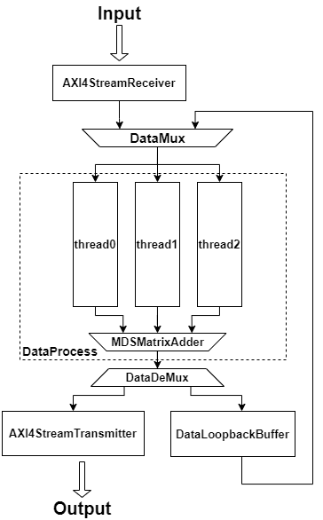
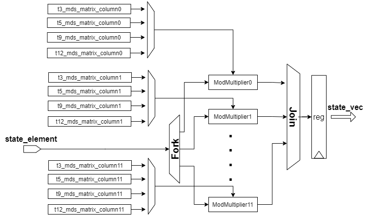
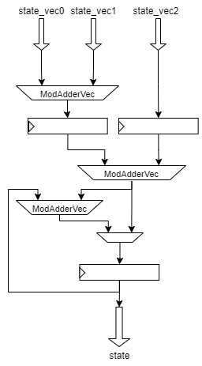
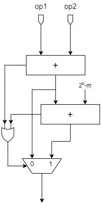
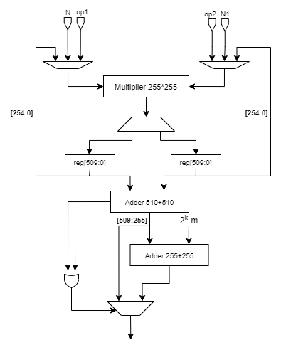

## Poseidon-SpinalHDL

This project  implements a hardware accelerator for hash function ***Poseidon***, which is used in  ***Filecoin***'s sealing process. The hardware design is accomplished in [SpinalHDL](https://spinalhdl.github.io/SpinalDoc-RTD/master/index.html), a new HDL which is more efficient than verilog,  and is tested under [cocotb](https://docs.cocotb.org/en/stable/#) testing framework. In addition to hardware implementation, this project also includes a python-based software implementation of ***Poseidon*** hash function, which is mainly used as a reference model for the verification of our hardware design. 

## Architecture Of The Accelerator

Filecoin's Poseidon instances take preimages of varying lengths (2, 4, 8, and 11 field elements) and always return one field element. And the preimage is transformed into the initial state of varying lengths(3, 5, 9, 12 field elements) through domain separation operations. Then the initial state is transformed into the final state through RF full rounds and RP partial rounds, each round including modular addition, modular exponentiation and modular matrix multipliacation. And the values of RF and RP are determined by the length of each preimage. The final output of the whole Poseidon hash function is the second element of the final state. 

The main two design ideas of accelerating the computation of ***Poseidon*** hash function in this accelerator are parallelization and pipeline. Each element of the internal state can be computed in each round independently before matrix multiplication, which needs to add up the multiplication result of each element. In order to make full use of hardware resource when computing each king length of internal state,   the parallelism is chosen to be 3, which is the common factor of 3,9,12 and for the state of 5 elements, only one channel of computation resource will be wasted. Besides the hardware design used pipeline trick to compute more internal states simultaneously and increase the working frequency of the circuit. The whole architecture of the accelerator is as below:

The accelerator uses AXI4-Stream interfaces to communicate with outsider. ***AXI4StreamReceiver*** is in charge of receiving data from outsider and parallelize the serial input to the degree of parallelism of 3 for parallel computation. Correspondingly,  ***AXI4StreamTransmitter*** is design to transmit the final result of one prime field element to outsider.  ***DataProcess*** area consists of all computation modules in the accelerator , including ***thread*** in charge of independent computation which can be executed parallelly and ***MDSMatrixAdder*** is used to add up multiplication result of each element in matrix multiplication and get a complete internal state.  ***DataLoopbackBuffer*** is designed to serialize the complete internal state from ***MDSMatrixAdder*** to the degree of parallelism of 3 when the length of internal state is 5, 9 or 12. When all computation rounds are completed, ***DataDeMux*** is designed to transmit the internal state to ***AXI4StreamTransmitter***, otherwise the state is transmitted to ***DataLoopbackBuffer*** to start the next round.

***DataMux*** in the top of the accelerator is a priority mux which chooses loopback data when both of the inputs are valid.

## Design Of SubModules

The design of ***thread*** in charge of  most of the computation process is showed as below:

At the end of every partial or full round, the state is transformed via vector-matrix multiplication with the MDS matrix :
$$
state=state\times M
$$
**state** is a vector composed of **t** (t = 3,5,9,12) prime field elements and **M** stands for the MDS matrix composed of **t** * **t** elements. And the vector-matrix multiplication is completed by **MDSMatrixMultiplier** module and **MDSMatrixAdder** module. **MDSMatrixMultiplier** is designed to multiply one state element by elements of the corresponding row in the MDS matrix simultaneously to get a **state_vector**. And the next internal state is the addition result of **t** **state_vectors**. The design of **MDSMatrixMultiplier** is showed as below :

The simplified structure of **MDSMatrixAdder** is showed as below. It is designed to complete additions in matrix multiplication. It needs to add up **t** state_vectors generated by **MDSMatrixMultiplier** to get the next internal state.

## Modular Arithmetic Operator

The arithmetic operations in the ***Poseidon*** hash function are all modular, including 255-bit modular addition and multiplication. The definition of modular arithmetic operations are easy to understand. But it is hard to design and implement an efficient circuit to realize the modular computation of big-bit numbers when considering how to balance the performance, power and area. The design of modular adder and multiplier is showed as below:

 The regular idea of implementing a modular adder needs one basic adder, one comparator and one subtractor. The output of the adder is compared with the modulus to decide whether it exceeds the modulus and needs to be subtracted by the modulus. Another idea which is used in this accelerator is showed above, which only uses two adders to realize the modular addition, which has a better performance and costs less logic resources.

The modular multiplier in this accelerator is designed based on ***Montgomery*** reduction algorithm, which can replace the division in the modular multiplication by shifting. But ***Montgomery*** needs three times of basic multiplication. The modular multiplier in this accelerator just implements one 255*255 basic multiplier and reuses it three times in each modular multiplication. The simplified structure of the modular is showed above.

