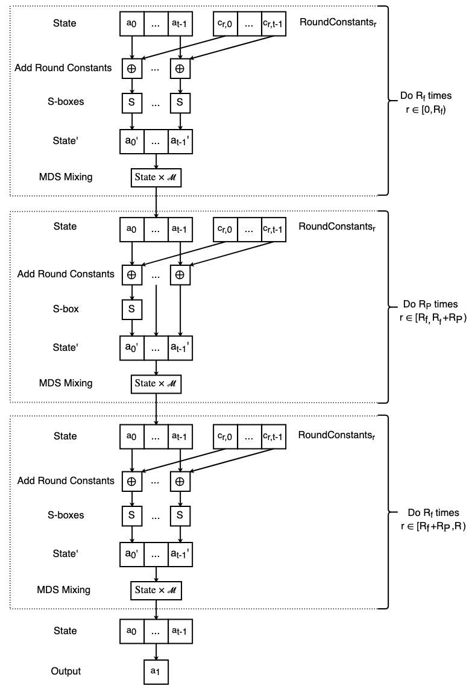
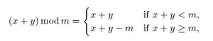
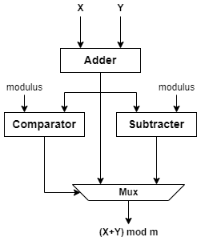
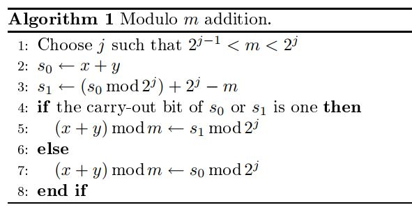
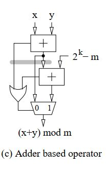
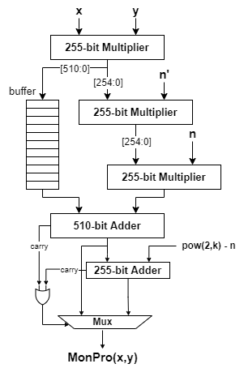
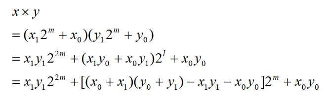
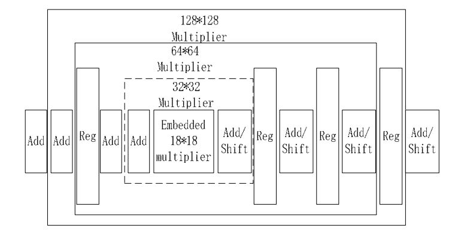
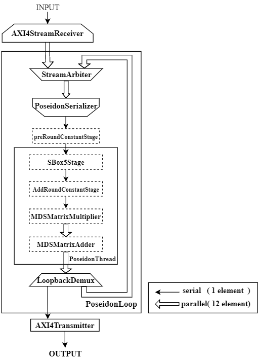

## Poseidon-SpinalHDL

This project  implements a hardware accelerator for ***Poseidon*** hash function, which is used in [Filecoin](https://filecoin.io/)'s sealing process. The hardware design is accomplished in [SpinalHDL](https://spinalhdl.github.io/SpinalDoc-RTD/master/index.html), a new HDL which is more efficient than verilog,  and is tested under [Cocotb](https://docs.cocotb.org/en/stable/#) testing framework. In addition to hardware implementation, this project also includes a python-based software implementation of ***Poseidon*** hash function, which is mainly used as a reference model for the verification of our hardware design. 

## Poseidon Hash Function
Poseidon is a new hash function which has been designed to be friendly to zero-knowledge applications, specifically, in minimizing the proof generation time, the proof size, and the verification time. For example, Poseidon hasher is used in the zero-knowledge proof system of FileCoin, an IPFS based decentralized storage network. The computation of Poseidon Hasher involves a large amount of compute-intensive modular multiplications, making it one of the performance bottlenecks in the mining process of FileCoin.

The Poseidon hasher used in Filecoin takes a preimage of (t-1) prime field elements to a single field element. For Filecoin, t can be 3, 5, 9, and 12, which means that the length of preimages can be 2, 4, 8, and 11 and each prime field element is 255-bit. Firstly, the preimage of Poseidon is initiated to the internal state of t prime field elements through domain separation process. And then the internal state is transformed over R (R=RF+RP) rounds of constant addition, S-boxes, and MDS matrix mixing. Once all rounds have been performed, Poseidon outputs the second element of the internal state. The data flow of Poseidon is shown in the picture below:

From the picture above, we can find that Poseidon has two kinds of rounds, which are RP partial rounds and RF full rounds. Poseidon calculates half of the full rounds first and then all of partial rounds and finally the remaining half of the full rounds. And the only difference between the two is that: partial rounds only compute the first element of the internal state in SBox stages, but full rounds transform all elements through SBox.

In the round constant addition stage, each prime field element is added by its corresponding round constant, and the constants are different in each round. For Filecoin’s Poseidon instantiation, S-Box computes the fifth power of the state element. And in the MDS Mixing stage, a vector-matrix multiplication is applied in the vector of internal state, where the MDS matrix is t*t and consistent in every round.

In general, the Poseidon Hasher can be perceived as a simple stream of arithmetic operations, including addition and multiplication. And the design of Poseidon accelerator can be divided into two main parts:
- design hardware arithmetic modules with high performance-area ratio
- design an architecture that can organize these arithmetic modules well to achieve better utilization and throughput. 
## Modular Arithmetic Operator
It’s worth noting that Poseidon Hasher operates elements of finite field, which means all arithmetic operations are modular. Compared to normal arithmetic, modular arithmetic operations are more complicated in circuit implementation and lack existing mature IP to use. There are two kinds of modular operations involved in Poseidon Hasher, that is modular addition and modular multiplication. This project implements these two kinds of modular arithmetic circuits based on the existing adder IP and multiplier IP provided in by Xilinx.
### Modular Adder
The modulo m addition of two numbers x and y is defined by:

The regular modular addition can be straightforwardly implemented by a normal adder, a comparator, and a subtracter following the definition above. The specific implementation: x and y are added through an adder first, and then the addition result minus the modulus is computed through a subtracter, and finally the addition result is compared with the modulus through a comparator to decide whether to output the addition result or the subtraction result. 

But this implementation is expensive both in terms of area and delay due to the usage of a comparator. So in this project, we implement the modular adder following the algorithm below:

In this algorithm, we can just utilize two normal adders and a Mux to realize the function of modular addition. And this implementation shown in the picture below can reach a higher performance-area ratio than the regular one.

The width of finite field elements in Poseidon is 255 and 255-bit addition has a long logic delay, so we implement the addition through Xilinx Adder/Sub IP in which we can choose the number of pipestages in an adder. Otherwise, the project also provides another version of modular adder in which normal adders are implemented through the plus sign directly and has no pipeline stages.

### Modular Multiplier
Modular multiplication problem is defined as the computation of P = A × B (mod m), given the integers A, B and m.
It is usually assumed that A and B are positive integers with 0 ≤ A, B < m. There are many approaches to perform multiplication such as multiply then divide, interleaving multiplication and reduction. Normally modular multiplication is done by repeated subtraction of modulus from the multiplicand until the result is smaller than modulus. This technique is time consuming when the value of modulus is too large. Modular Multiplication can be also performed by division of the modulus. This technique will require many hardware resources and take time since division is a complicated and compute-intensive task from the perspective of hardware. 

In this project, the implementation of modular multiplication adopts the Montgomery reduction algorithm which avoids the compute-intensive division. The main idea of Montgomery algorithm is to transform the operands into Residue Number System(RNS) domain and in this domain the division used for the reduction of multiplication results in normal domain can be replaced by right shifting. A brief description of Montgomery algorithm is as below:

1) Given integers a,b < n (n is the modulus), we define their n-residue format with respect to r (r is a power of two and greater than the modulus) as:
$$\overline{a}=a \cdot r \ mod \ n$$
$$\overline{b}=b \cdot r \ mod \ n$$

2) In order to describe the Montgomery reduction algorithm, we need an additional quantity, n', which is the integer with the property:
$$r \cdot r^{-1}-n \cdot n' =1 $$

3) Given n-residues of a and b, Montgomery product is defined as:

   $function \ MonPro(\overline{a},\overline{b})$

    $step\ 1: \ t = \overline{a} \cdot \overline{b} \ mod \ r $

    $step\ 2: \ m = t \cdot n' \ mod \ r $

    $step\ 3: \ u = (\overline{a} \cdot \overline{b} + m \cdot n)/r $

    $step\ 4: \ if u \geq n \ then \ return \ u-n\ else \ return \ u $

After Montgomery Production, the result is still in n-residues domain and you can transform the result into normal domain by computing MonPro(res, 1) or continue to perform another multiplication. For more details about Montgomery algorithm, you can access this [website](https://en.wikipedia.org/wiki/Montgomery_modular_multiplication).

In the formula of Montgomery Prodution above, n, n' and r are pre-set or can be precomputed, and r is a power of 2 which means division in Step 3 can be simplified to shifting. So arithmetic operations in this algorithm just include three normal multiplications, one normal addition and a conditional subtraction. The brief structure of the modular multiplier based on Montgomery algorithm is shown in the picture below. In order to reach higher performance, normal multipliers and adders used in Montgomery multiplier are all instantiated from existing IPs provided by Xilinx and are all fully pipelined, which means the design can compute a 255-bit modular multiplication in one cycle.

However, the maximum width of multiplier IP in Vivado is 64-bit, so the 255-bit multiplier can’t be accessed directly by instantiating the existing IP. We need to combine some low-bit multipliers to get a 255-bit multiplier. In this project, we use Karatusba-Ofman Algorithm, which needs much less small multipliers than other algorithms to build a same size multiplier. The way Karatusba-Ofman decomposes a bigger multiplier into small multipliers is shown below:

The algorithm only uses 3 half-word multipliers to build a full-word multiplier. According to the idea of recursion, the 256-bit multiplier can be decomposed to 128-bit, and then decomposed to 64-bit, and finally composed to 32-bit, the width we set in Xilinx multiplier IP.

The structure we used to build a 255-bit multiplier from 32-bit Xilinx Multiplier IPs is shown as below:

## Accelerator Architecture
The architecture of Poseidon accelerator is modelled on the dataflow picture of Poseidon shown in Section 1 with some variations of serial-parallel conversion. The brief structure of accelerator is shown in the picture below. The bigger arrows in the picture indicate the data is transfered parallelly with all elements of the internal state(3, 5, 9 or 12 elements) sent in one cycle. The smaller arrows indicate data is transfered serially with one element of internal state sent in one cycle. The basic idea of how the accelerator operates is that: the PoseidonThread module implements the complete computation process of one round in Poseidon( the number of rounds in Poseidon ranges from 63 to 65) and the accelerator reuses PoseidonThread to compute all rounds, either partial or full, and outputs the second element of the internal state when all rounds are finished.

Two main ideas of accelerating the computation of Poseidon in this accelerator are parallelization and pipeline. As for pipeline, all arithmetic operators including multipliers and adders are all pipelined to diminish the logic delay in our design. To be more specific, the 255-bit modular multiplier and adder are divided into 47 and 33 pipeline stages respectively. And it takes approximately 200 cycles for PoseidonThread to transfer data from input port to output port. And the whole design can operate at the frequency of more than 100MHz. In terms of parallelization, the data flows serially before MDSMatrixMultiplier and parallelly in the rest of PoseidonThread. The reason for partial parallelization in our design includes: 
1) the toplevel input of Poseidon accelerator from XDMA IP is serial, which means one element is transfered in one cycle;
2) the vector-matrix multiplication in MDS Mixing stage needs up to 144 modular multipliers if all elements of internal state are computed parallelly, which is impossible to implement due to the restriction from limited FPGA resources. 

So only 12 multipliers are implemented in MDSMatrixMultiplier, making it able to parallelly compute all 12 multiplications related to one element of the vector. Additionally, if the project is transplanted to FPGA boards with more resources, parallelism and performance can be improved by instantiating more PoseidonLoop modules.

The specific operating mechanism of Poseidon accelerator includes: 
1) AXI4StreamReceiver module receives the serial input(one state element in one cycle) from XDMA IP, counts the size of internal state according to last signal in AXIStream protocol and then outputs internal state parallelly. 
2) StreamArbiter in PoseidonLoop is a 2-1 priority arbiter receiving output from AXI4StreamReceiver and LoopbackDemux, and the loopback input has the higher priority to avoid the deadlock of the pipeline loop. 
3) PoseidonSerializer is in charge of serializing the parallel output from the arbiter and sending it to PoseidonThread which executes arithmetic operations in Poseidon hasher. 
4) In PoseidonThread, SBox5Stage, AddRoundConstantStage corresponds to S-boxes and Add Round Constants in dataflow picture shown in Section2. And MDSMatrixMultiplier and MDSMatrixAdders accomplish the computation of MDSMixing in Poseidon hasher jointly. 
5) DataDemux is a 1-2 router that transfers the output of PoseidonThread to AXI4Transmitter or StreamArbiter. If all rounds are completed, the internal state is transmitted to AXI4Transmitter, otherwise it loops back to StreamArbiter and starts computation of next round. 
6) AXI4Transmitter outputs the hash result under AXI4 Stream protocol to XDMA IP and a fifo is implemented in it to reorder and buffer the input from LoopbackDemux.

